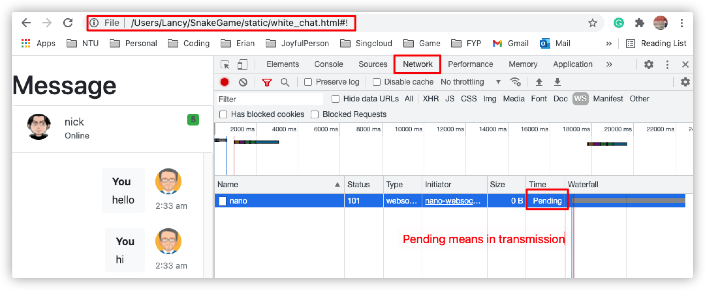

# Cocos_ChatRoom

## Frontend

- Platform : Cocos Creator  (Dashboard 2.4.3)

- Getting Start: https://docs.cocos.com/creator/manual/en/

- Project Source Code: https://github.com/lancyrosy/Cocos_Snake 

#### Setups for Cocos_ChatRoom (Frontend)

- Clone/Download Cocos_ChatRoom Project from Github

- Install and setup Cocos Creator

- Import project to Dashboard and launch it using Dashboard 2.4.3

- Run the simulation using Browser(suggested) or simulator 

## Backend

- Platform: Nano Server 

- Getting Start: https://github.com/lonng/nanoserver

- Project Source Code: https://github.com/lancyrosy/SnakeGame 

- Nano Websocket Client: https://github.com/nano-ecosystem/nano-websocket-client

#### Setups for Nano Server (Backend)

- Install Golang

- Install WampServer (Local SQL Database Server)

- Run Local SQL Database,login as root without password 

- Define User colomns (For login) 

- Clone/Download SnakeGame Project from Github

- Run SnakeGame project by 'go run main.go'

- Test SnakeGame/static/index.html 

- Login different users using different browser

- Test SnakeGame/static/white_chat.html functionality 

#### Demo 

## Combine Cocos Project with Nano Server 

- Finish Setups for frontend and backend

- Run SnakeGame project 

- Run Frontend/Cocos_ChatRoom in browser 

- Debug in Browser's console

#### Demo 

